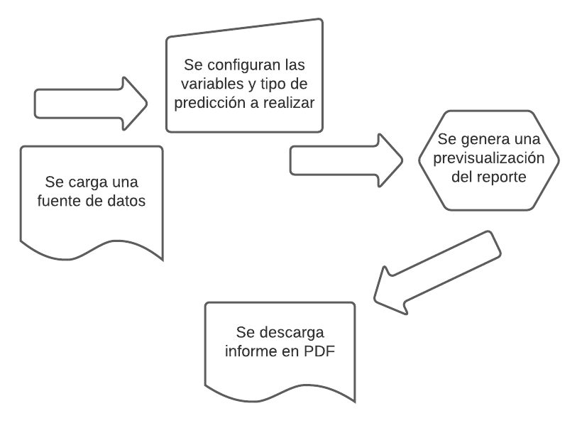
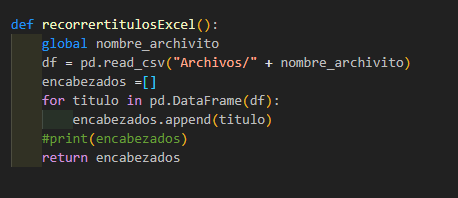
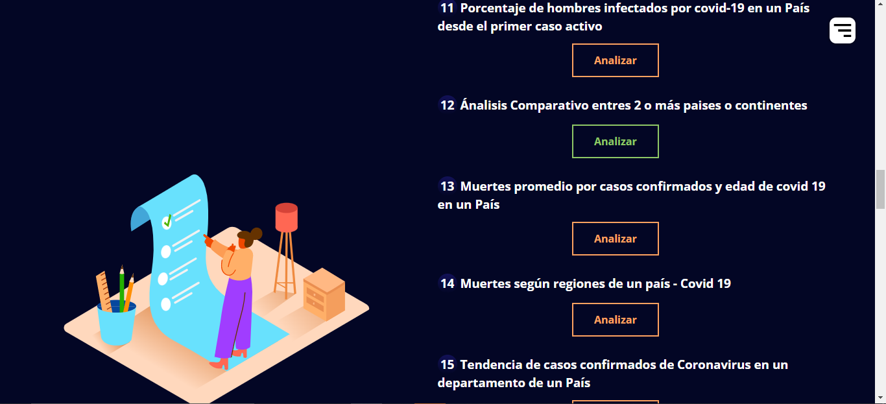
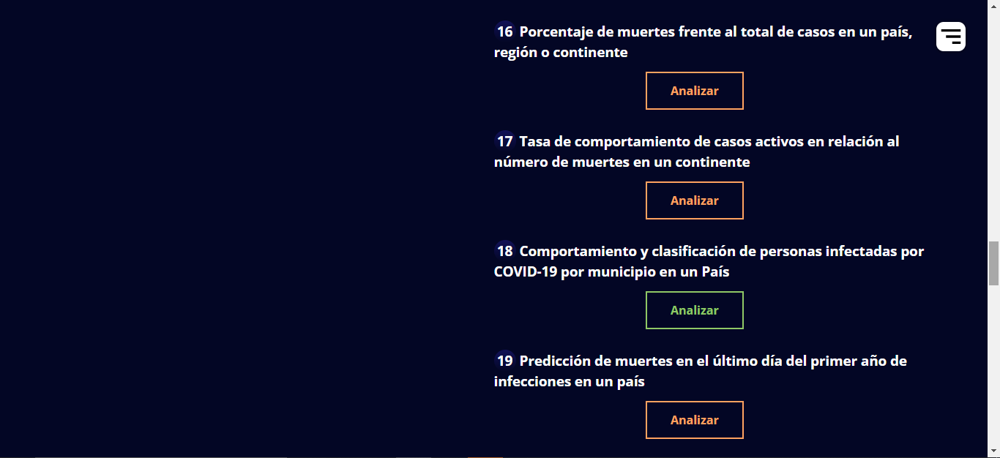
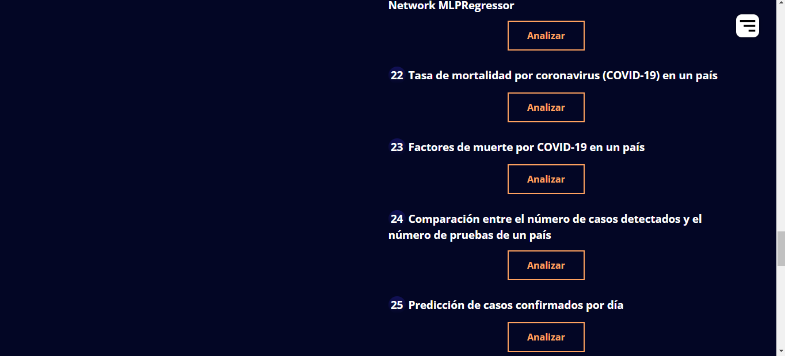
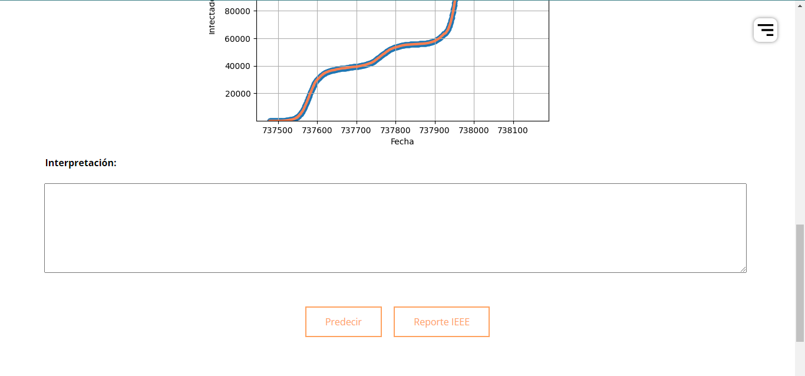

### 

# **Coronavirus Data Analysis With Machine Learning**

Escuela de Ciencias y Sistemas

Organización de Lenguajes y Compiladores 1

Vacaciones Diciembre de 2021

## Indice
1. [General Info](#general-info)
2. [Technologies](#technologies)
3. [Installation](#installation)
4. [Collaboration](#collaboration)
5. [FAQs](#faqs)

## Objetivos
***
Aplicar inteligencia artificial para lograr entrenar un modelo, el cual nos ayude a realizar predicciones a un futuro o sobre la tendencia del coronavirus:
* Realizar un analisis de tendencias sobre las graficas.
* Realizar un analisis de regresion sobre las graficas que nos indiquen.

## Funcionalidad
***
* Interpretar resultados que se pueden obtener sobre las graficas
* Se requiere la implementación de una Aplicación Web que permita el ánalisis de la información, y con esta poder terminar diferentes parametros de medición y configuración para desplegar gráficas y resultados de forma agradable y de fácil entendimiento para el usuario.

## Flujo de la aplicación
***


# Descripcion del sistema
Durante la emergencia sanitaria provocada por el COVID-19, se ha observado un notable incremento en la aplicación de nuevas tecnologías al campo de la salud y la investigación. Desde la creación de todo tipo de dispositivos inteligentes destinados a detectar el más mínimo síntoma indicativo de contagio, hasta el diseño de nuevos patrones de investigación en la cura del nuevo coronavirus.

Mediante el procesamiento y análisis de noticias de todos los países del mundo, junto con información relacionada con rutas de vuelos comerciales y brotes de enfermedades, pudieron predecir, no solo la existencia de una enfermedad potencialmente pandémica, sino también el epicentro de la enfermedad. Así mismo, como su trayectoria más inmediata.

# Requerimientos minimos
> 1. Tener instalado un navegador web.


> 2. Tener acceso a internet 


# Especificación de Tecnologías utilizadas

## HTML 5

HTML 5 (HyperText Markup Language, versión 5) es la quinta revisión importante del lenguaje básico de la World Wide Web, HTML. HTML5 específica dos variantes de sintaxis para HTML: una «clásica», HTML (text/html), conocida como HTML5, y una variante XHTML conocida como sintaxis XHTML 5 que deberá servirse con sintaxis XML (application/xhtml+xml).1​2​ Esta es la primera vez que HTML y XHTML se han desarrollado en paralelo. La versión definitiva de la quinta revisión del estándar se publicó en octubre de 2014.3​

Al no ser reconocido en viejas versiones de navegadores por sus nuevas etiquetas, se recomienda al usuario común actualizar su navegador a la versión más nueva, para poder disfrutar de todo el potencial que provee HTML 5.


## CSS 3

CSS es un lenguaje de diseño gráfico que permite definir y crear la presentación de un documento estructurado escrito en un lenguaje de marcado. Es muy usado para establecer el diseño visual de los documentos web e interfaces de usuario escritas en HTML.

En la propia definición de CSS vemos que está muy ligado desde su nacimiento a HTML. Desde que nació, el objetivo de CSS fue poner un poco de orden a la hora de aplicar los estilos a las páginas web.


## Javascript

JavaScript es un lenguaje de programación o de secuencias de comandos que te permite implementar funciones complejas en páginas web, cada vez que una página web hace algo más que sentarse allí y mostrar información estática para que la veas, muestra oportunas actualizaciones de contenido, mapas interactivos, animación de Gráficos 2D/3D, desplazamiento de máquinas reproductoras de vídeo, etc., puedes apostar que probablemente JavaScript está involucrado. Es la tercera capa del pastel de las tecnologías web estándar


## Codemirror

CodeMirror es un componente de JavaScript que proporciona un editor de código en el navegador. Tiene una API de programación rica y un enfoque en la extensibilidad.

La primera versión del editor fue escrita a principios de 2007, para la consola del sitio web de Eloquent JavaScript. El código fue empaquetado por primera vez y publicado bajo el nombre de CodeMirror en mayo de 2007. Esta versión se basaba en la función contentEditable de los navegadores.1​

A finales de 2010, el proyecto Ace, otro editor de código basado en JavaScript, fue pionero en nuevas técnicas de implementación y demostró que es posible, incluso en JavaScript, manejar documentos con miles de líneas sin un rendimiento degradado. Esto provocó una reescritura de CodeMirror2​ según los mismos principios. El resultado fue la versión 2, que ya no dependía de contentEditable y mejoró significativamente el rendimiento.


## Flask

En la actualidad existen muchas opciones para crear páginas web y muchos lenguajes (PHP, JAVA), y en este caso Flask nos permite crear de una manera muy sencilla aplicaciones web con Python.

Flask es un “micro” Framework escrito en Python y concebido para facilitar el desarrollo de Aplicaciones Web bajo el patrón MVC.


# Comandos de Compilación

Instalacion scikit-learn
```
pip install -U scikit-learn
```
Para instalar la libreria que nos ayudara a realizar las graficas de las predicciones de nuestros informes. 

```
pip install matplotlib
```
Lenguaje de programacion que nos ayudara a programar nuestra aplicacion

```
pip install python
```

Instalacion browserify

```
npm install -g browserify
```
Instalacion de flask
```
pip install Flask
```

# Archivos principales
> index.html

> analisis.html

> IEEE.html

> iniciorep.html

> template.py

> Cargararchivo.py

> Subirarchivo.py

# Librerias
>import os

>from re import X

>from flask import Flask

>from flask import request

>from flask import render_template

>from werkzeug.utils import secure_filename

>from werkzeug.datastructures import  FileStorage

>import matplotlib.pyplot as plt

>import numpy as np

>import pandas as pd

>from sklearn import linear_model

>from sklearn.metrics import mean_squared_error, r2_score

>from flask_wtf import FlaskForm 

>from wtforms import SelectField

>from datetime import date, datetime

>import seaborn as sns

>from sklearn.linear_model import LinearRegression  

>from sklearn.preprocessing import PolynomialFeatures 

>from sklearn import preprocessing

# Metodos principales
* Uploader: Metodo que se encarga de obtener la ruta del archivo. 


* Recorrer CSV: Metodo que se encarga de recorrer todos los titulos de nuestro csv



* App: Metodo principal que ejecuta toda la aplicacion 


# Interfaz
1. Se cuenta con una pantalla de inicio la cual muestra el nombre del programa Coronavirus Data Analysis With Machine Learning


2. Se cuenta con un area de carga de documentos tipo csv, que nos ayudaran a realizar el analisis correspondiente.


3. Opciones de analisis: Nos muestra un listado con todas las opciones de informe con las que contamos.

* 

* 

* 

* 

* 

* 

4. Manuales: Ventana que nos muestra un boton del manual de usuario y tecnico.

* 

5. Ventana que nos muestra el titulo y la opcion de ingresar o regresar al inform

* 

6. Ventana que nos pedira los datos requeridos para realizar el analisis correspondiente

* 

7. Ventana que nos muestra los botones que nos permitiran realizar el analisis o enviarnos a descargar nuestro reporte del analisis correctapondiente.

* 

8. Ventana que nos muestra el reporte en formato IEEE del analisis que hemos realizo, el cual se podra descargar en formato .pdf.
* 

9. Ventana que nos muestra los botones que nos redirigen a los distintos manuales que se tienen.

* 

* [Manual tecnico](https://github.com/isabelgonz20/OLC2_Proyecto2/blob/master/Proyecto/Manuales/Tecnico.md): Manual tecnico
* [Manual Usuario](https://github.com/isabelgonz20/OLC2_Proyecto2/blob/master/Proyecto/Manuales/Usuario.md): Manual Usuario

# Link pagina
***
* [Pagina web](http://34.125.68.190:8000/): Coronavirus Data Analysis With Machine Learning 