### 

# **Coronavirus Data Analysis With Machine Learning**

Escuela de Ciencias y Sistemas

Organización de Lenguajes y Compiladores 1

Vacaciones Diciembre de 2021

## Indice
1. [General Info](#general-info)
2. [Technologies](#technologies)
3. [Installation](#installation)
4. [Collaboration](#collaboration)
5. [FAQs](#faqs)

## Objetivos
***
Aplicar inteligencia artificial para lograr entrenar un modelo, el cual nos ayude a realizar predicciones a un futuro o sobre la tendencia del coronavirus:
* Realizar un analisis de tendencias sobre las graficas.
* Realizar un analisis de regresion sobre las graficas que nos indiquen.

## Funcionalidad
***
* Interpretar resultados que se pueden obtener sobre las graficas
* Se requiere la implementación de una Aplicación Web que permita el ánalisis de la información, y con esta poder terminar diferentes parametros de medición y configuración para desplegar gráficas y resultados de forma agradable y de fácil entendimiento para el usuario.

## Flujo de la aplicación
***
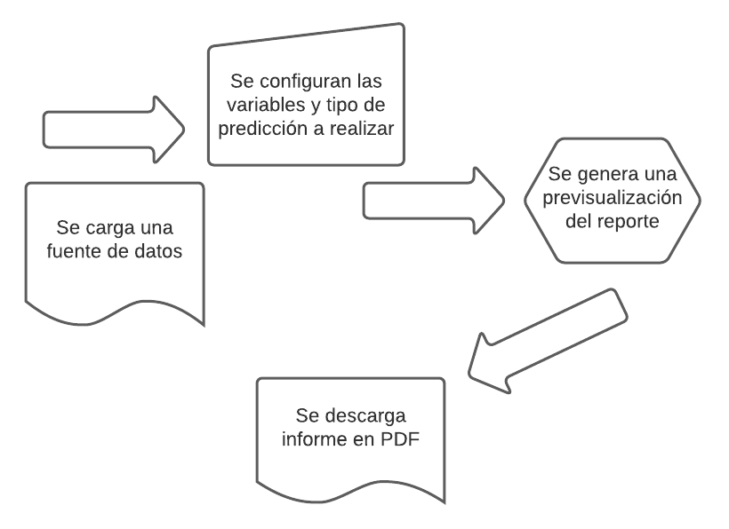

# Descripcion del sistema
Durante la emergencia sanitaria provocada por el COVID-19, se ha observado un notable incremento en la aplicación de nuevas tecnologías al campo de la salud y la investigación. Desde la creación de todo tipo de dispositivos inteligentes destinados a detectar el más mínimo síntoma indicativo de contagio, hasta el diseño de nuevos patrones de investigación en la cura del nuevo coronavirus.

Mediante el procesamiento y análisis de noticias de todos los países del mundo, junto con información relacionada con rutas de vuelos comerciales y brotes de enfermedades, pudieron predecir, no solo la existencia de una enfermedad potencialmente pandémica, sino también el epicentro de la enfermedad. Así mismo, como su trayectoria más inmediata.

# Requerimientos minimos
> 1. Tener instalado un navegador web.

> 2. Tener acceso a internet 

# Interfaz
1. Se cuenta con una pantalla de inicio la cual muestra el nombre del programa Coronavirus Data Analysis With Machine Learning

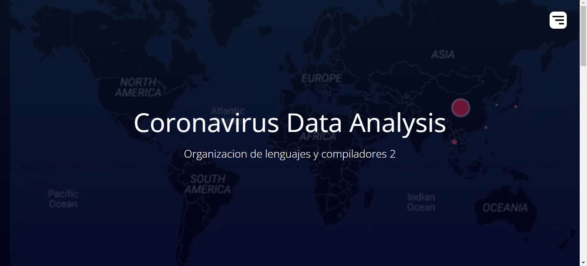

2. Se cuenta con un area de carga de documentos tipo csv, que nos ayudaran a realizar el analisis correspondiente.

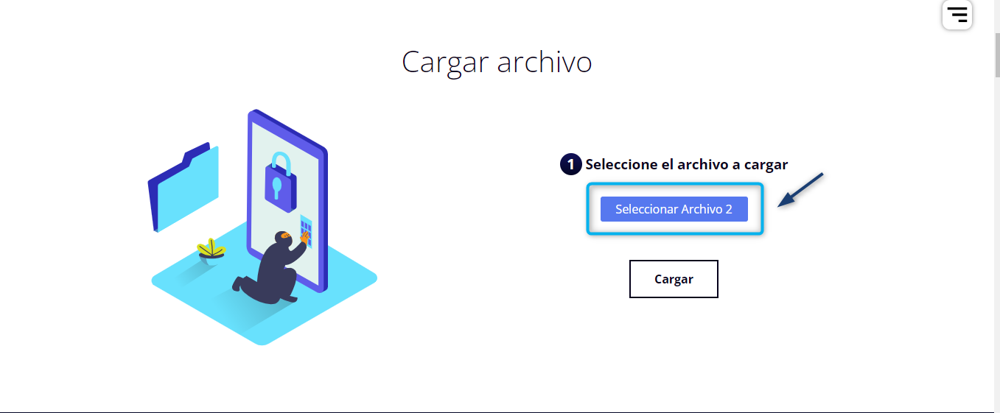

3. Opciones de analisis: Nos muestra un listado con todas las opciones de informe con las que contamos.
* 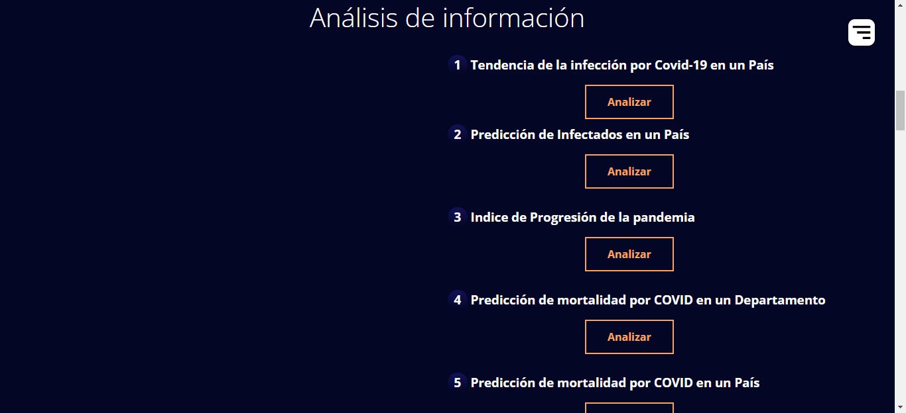
* 
* 
* 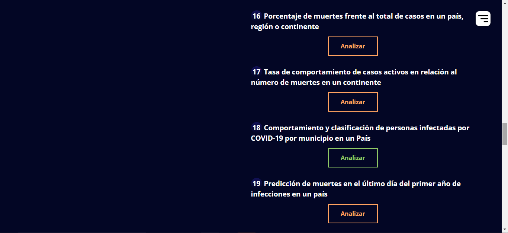
* 
* 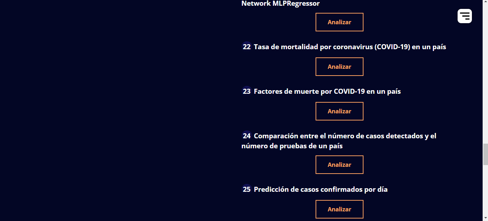

4. Manuales: Ventana que nos muestra un boton del manual de usuario y tecnico.
* 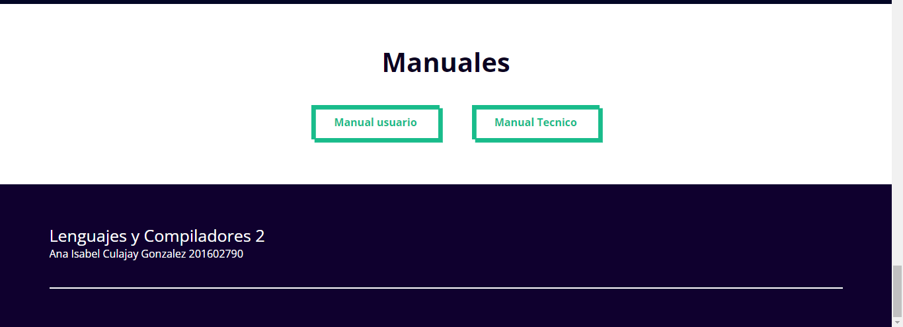

5. Ventana que nos muestra el titulo y la opcion de ingresar o regresar al inform
* 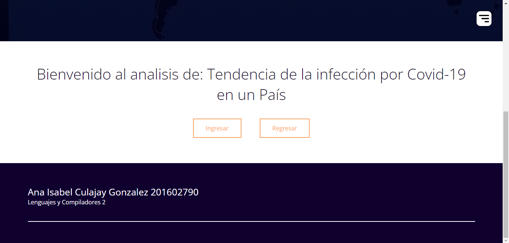

6. Ventana que nos pedira los datos requeridos para realizar el analisis correspondiente
* 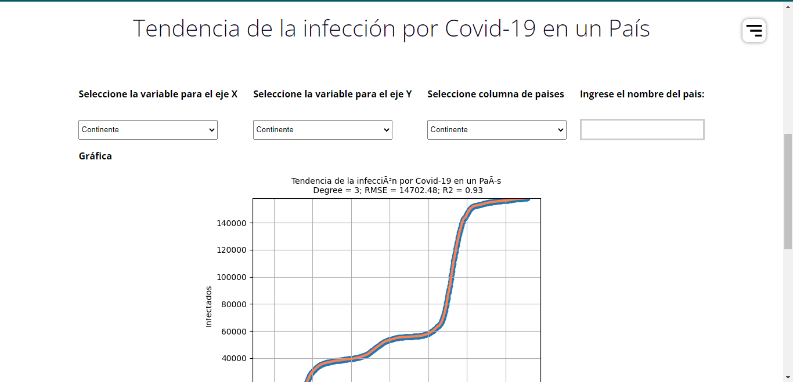

7. Ventana que nos muestra los botones que nos permitiran realizar el analisis o enviarnos a descargar nuestro reporte del analisis correctapondiente.
* 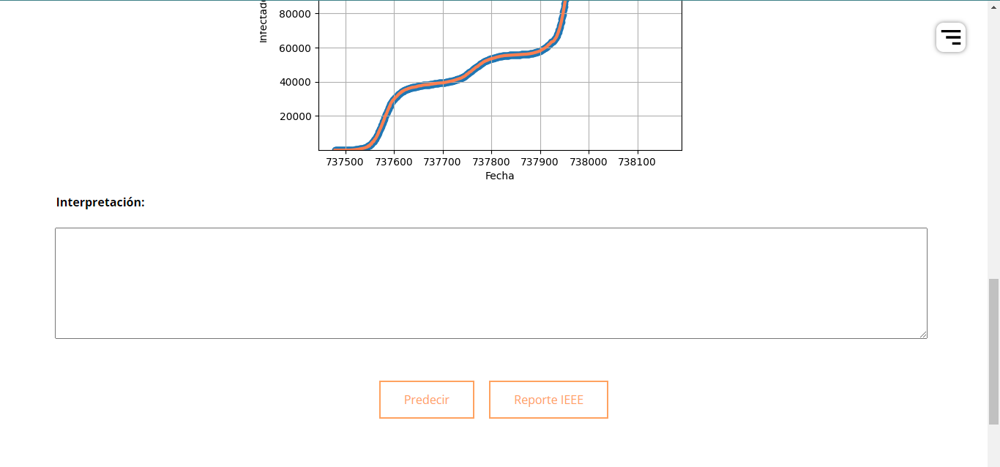

8. Ventana que nos muestra el reporte en formato IEEE del analisis que hemos realizo, el cual se podra descargar en formato .pdf.
* 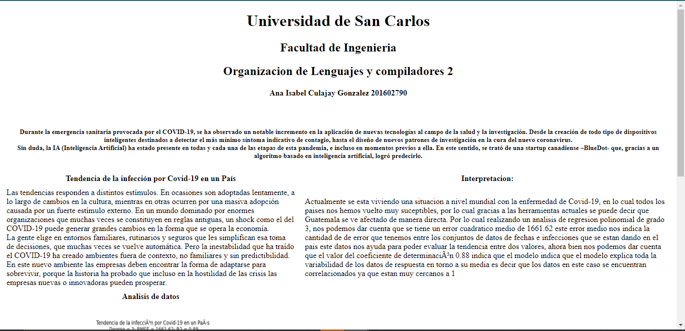

9. Ventana que nos muestra los botones que nos redirigen a los distintos manuales que se tienen.
* 
* [Manual tecnico](https://github.com/isabelgonz20/OLC2_Proyecto2/blob/master/Proyecto/Manuales/Tecnico.md): Manual tecnico
* [Manual Usuario](https://github.com/isabelgonz20/OLC2_Proyecto2/blob/master/Proyecto/Manuales/Usuario.md): Manual Usuario

# Link pagina
***
* [Pagina web](http://34.125.68.190:8000/): Coronavirus Data Analysis With Machine Learning